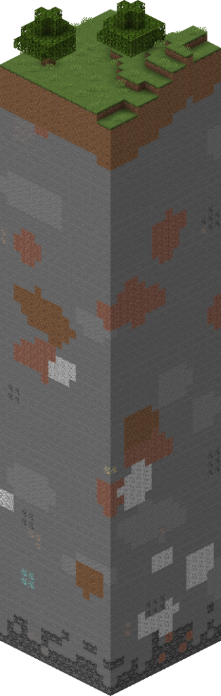

# Procedural Open World Game - A development nightmare


## Fundamental Data Understanding
Think about how big minecraft worlds are. It would be computationally expensive if we store the whole thing in memory. Therefore we must partition our world. 

<br>

### Chunks

In minecraft, partitioning is done by spliting the world into chunks, these chunks are 16 by 16 width and length, and 256 blocks in height. 

Different voxel engines may define different chunk sizes. but chunking is definitely a common and nessasary practice. We can say that our chunks would store:

`16 * 256 * 16 = 65,536 blocks`

We can use this chunks system to then store our blocks. and these chunks would then be a part of our larger world. 




Therefore chunks would need to have a few fundamental properties to store its data of blocks, and its location in our world. 

We can define them as follows:
```cs
public class ChunkData{
	public Vector3 chunkSize;
	public Vector3 chunkCoords;
	
	public World worldReference;
	
	public Block[] blocks;
}
```


### chunkSize
Defines the size of our chunk, we could do something like int width, height, length, but using a vector is less wordy.

### chunkCoords

<br>

---
# Design Pattern concerns
When it come to high complexity projects like this that involves large ammount of real time procedural data, that has to be processed very quickly, we must practice clean code.

We must ensure that our classes has a clear and distint separation of concern, and adhere to single responsibility principle. 

We must also separate our data classes, from method classes. This is important for easier refactoring. 

Data oriented design and CPU cache performance concerns can come later when we perform optimizations, but for now, prioritize getting the base nicely decoupled naive implementation done.


